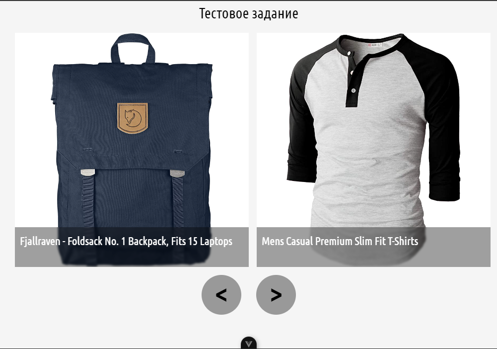

# Проект: FoodForce

**Автор:** Ющенко Дмитрий Владимирович  
**Телефон:** +375 (33) 642-06-58
**e-mail** dimcom1010@gmail.com
**telegram** @dimcom1010


## Описание проекта
Проект FoodForce использует фреймворк Vue.

### Настройки проекта при установки
- ** TypeScript** - √
- ** JSX Support** - √
- ** Pinia for state management** - √
- ** Vitest for Unit Testing** - Х
- ** an End-to-End Testing Solution** - Х
- ** ESLint for code quality** - Х

## Проделанная работа

| Работа                              | Время         |
|-------------------------------------|---------------|
| изучение материалов и инициализирован проект | 2 часа |
| настроена структура папок проекта   |    30 мин     |
| добавлен сервис для получения данных|    10 мин     |
| описана модель получаемых данных    |    10 мин     |
| подключён шрифт Ubuntu Condensed    |     5 мин     |
| установлен препроцессор и переход на Less| 15 мин   |
| созданы переменные less             |      15 мин   |
| создание компонента Slider          |     3 часа    |
| создание компонента Card            |     30 мин    |
| создание компонента Spinner         |     30 мин    |
| стилизация компонентов              |     3 часа    |
| добавление Footer                   |     15 мин    |
| написание документации              |   1 час  мин  |
| Итого                               |   11 час 40 мин  |

Разрешение 1200px


Разрешение 1000px


Разрешение 550px


Наведение на название продукта


Наведение на кнопку


Смена слайда 
 

Наведение на футер


## Инструкция для старта проекта
```sh
npm install
npm run dev 
```